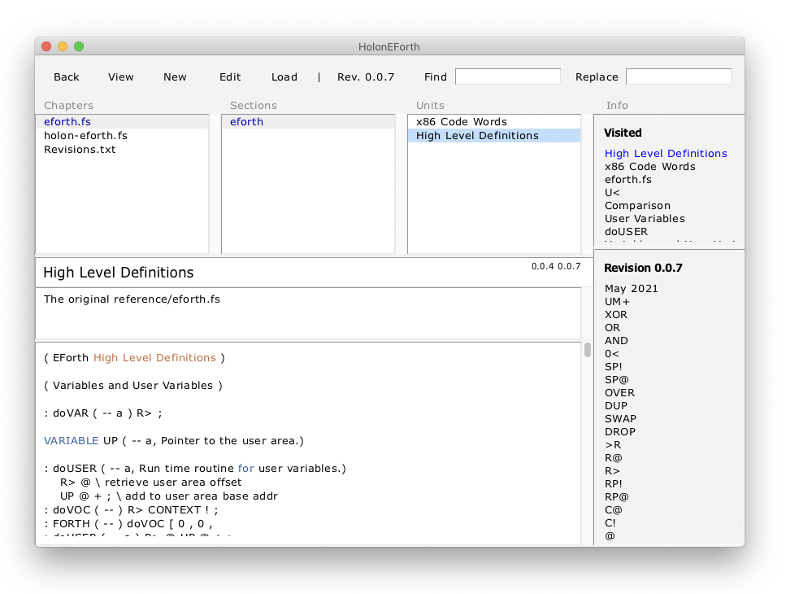

# HolonEForth

### HolonEForth = HolonCode Projekt





## eforth.fs

### Textfile


#### List of source code definitions and comments

####  Commentlines create structure


## HolonEforth

#### Content Management System

####  Book with Chapters, Sections and Pages

Chapters create files with the code of the contained units

Each chapter and section offers a page for project documentation

Unit pages are divided into separate panes for code and comments.  

The title pane usually contains the name of the definition.

The title name is as a target for hypertext links.

Database is Tcl Metakit.  Views statt Tabellen 


---


### Chapter eforth.fs


chapter page leer

section page leer

units 

- x86 Code Words
- High Level Definitions
  - File eforth.fs mit  code und colon
  - structure als comment lines


---


### Chapter HolonEForth.fs


Chapter page - eForth Overview
creates the file with all the units code - eforth is stored as one unit per forth definition - separated by the sections added in eforth.fs to group the words by function.

file holoneforth.fs entspricht eforth.fs.

---


## File HolonEForth.fs


---


## Section HolonEForth.fs

- Sections = 
  - Struktur Sections von eforth.fs
  - Page je Section - eForth Overview 
  - Units = Units von Section


---


## Unit HolonEForth.fs


- Units
  - Struktur von Section
  - Page Definition von Unit
    - Comment und Source


---


#### eforth.fs

in Chapter eforth.fs  Section eforth  Unit eforth.fs code teil

Chapter collects all unit code - now eforth.fs


### Features

see [HolonS](https://holonforth.com/holons.html)


### Run HolonEForth


* Works in Windows, macOS and Linux, wherever Tcl/Tk runs.

#### Windows

```
tclsh .\src\holoncode.tcl HolonEForth.hdb
````
#### macOS and Linux

````
#!/bin/bash
cd `dirname $0` 
tclsh ./src/holoncode.tcl HolonEForth.hdb &
````

