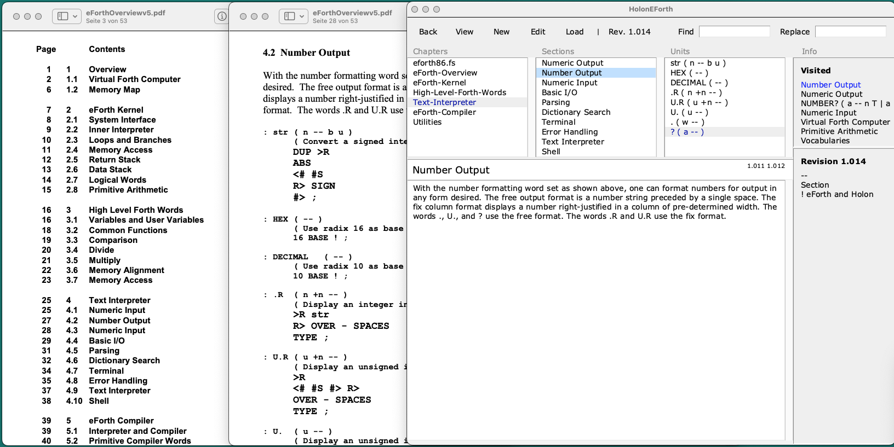

# HolonEForth

HolonEForth combines Chen-Hanson Ting's universal eforth.fs and eForthOverview.pdf. 

It presents source code and documentation together in a content handling system.

   

### Stream versus Struct

Dr. Ting's great eForthOverview.pdf has been enhanced with a table of contents. 
It is still a stream. Look up words with searches. 

HolonEForth structures the overview into chapters, sections, and units. The text areas of chapters and sections contain the documentation. 
The units collect the source definitions and comments in separate panes. 

Forth words in the text are links to their units. Click the word to see the definition, control-click to see the places where the word is used.

-------

## Run HolonEForth

HolonEForth works in Tcl/Tk in Windows, macOS and Linux. 

#### RunWindows.bat

#### RunMacOS.command

####  RunLinux.sh

---------------

Download the free Tcl/Tk at https://docs.activestate.com/activetcl/8.6/

---

## Notes

HolonEForth is a [HolonCode](https://github.com/wejgaard/HolonCode) project.

The folder <u>holonxf</u> contains the HolonCode source files enhanced with stack notations.

The folder <u>holoneforth</u> collects the chapter files generated with a .fs extension

<u>holoneforth.hdb</u>  is the <u>database</u> of the HolonEForth IDE.

