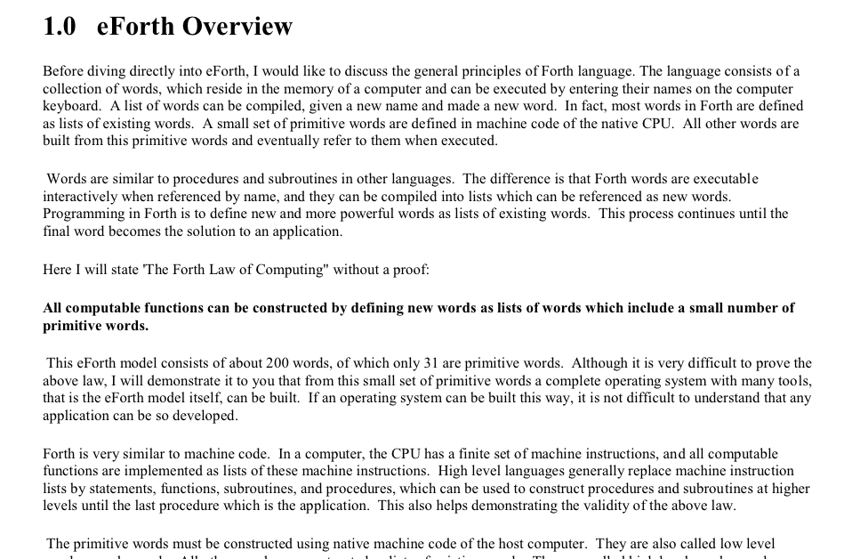
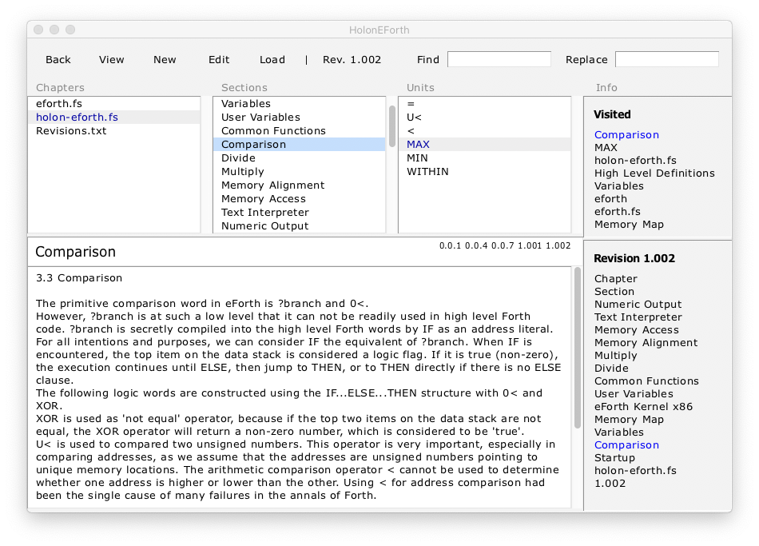

# HolonEForth

HolonEForth combines Chen-Hanson Ting' s universal eforth.fs and eForthOverview.pdf in a CMS, 

and presents and handles source code and documentation together in a book view.

Chapters create files, sections collect related program units, units have separate spaces for comments.

HolonEForth is a [HolonCode](https://github.com/wejgaard/HolonCode) project. 


## File eforth.fs

- List of source code definitions and comments
- Comment lines create structure


## File eforthOverview.pdf

- Documentation of eForth 

- Detailed description of the eForth words and functions.

  


---


## Book HolonEForth

- Content Management System
- The whole project combined.
- Chapter and section pages collect project documentation
- Units contains source definition and separate comments 
- Chapters create files.
- Automatic Hypertext links throughout the system


### eForth Chapter eforth.fs

- Chapter, Sections and Units have a Forth screen as page. 
- No chapter text in eforth.fs.
- Only one Section - eForth creates sections in the code with comment lines 
- The units code fields contain the respective eForth files
- The chapter file contains the code of the contained units 
  - thus the  x86 Code Words and High Level Definitions


###  Unit "High Level Definitions"

- Chapterfiles contain the code units in the chapter.
- Here the units are the eforth files with the kernel and high level words.
- The chapterfile combines both.
- A unit can contain as much code as you want, there is no defined limit.
- Usually a Holon unit contains one code unit.
- The units are separated in holon-eforth.fs  


### Chapter holon-eforth.fs

- The chapter page contains the introduction to OverviewEforth.pdf
- Sections are extracted from the document
- Units of the current section 


### HolonEForth Section Comparison

- With overview and units.




### HolonEForth Unit U<

- Unit page with source code definition and a separate pane for comments.
- The source code is written to the chapter file at the start of a session and on every change.


## File holon-eforth.fs

- Chapterfile of HolonEForth.
- Pipe to the interpreter/compiler.
- Instantly updated with changes in the browser.


---


## Run HolonEForth

#### Windows

```
tclsh .\src\holoncode.tcl HolonEForth.hdb
````

#### macOS and Linux

````
#!/bin/bash
cd `dirname $0` 
tclsh ./src/holoncode.tcl HolonEForth.hdb &
````


## Notes

#### tclsh

Download and install the free Tcl/Tk via https://docs.activestate.com/activetcl/8.6/

#### src/holoncode.tcl

Project source code copied from the HolonCode repository.

#### HolonEForth.hdb

The database of the CMS. Contains the complete project, recreates the source files at a new session.


