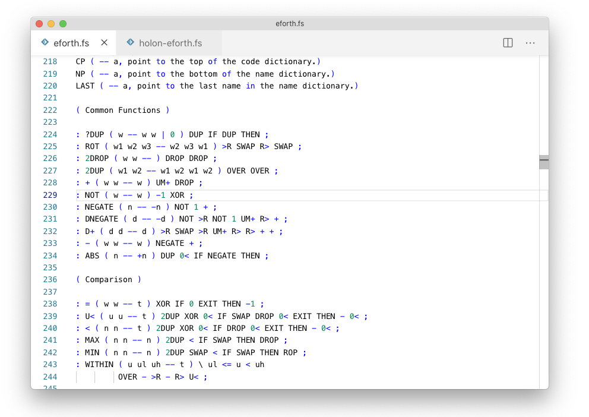
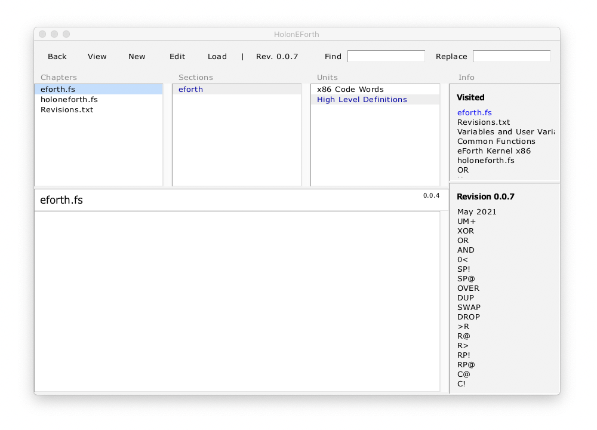
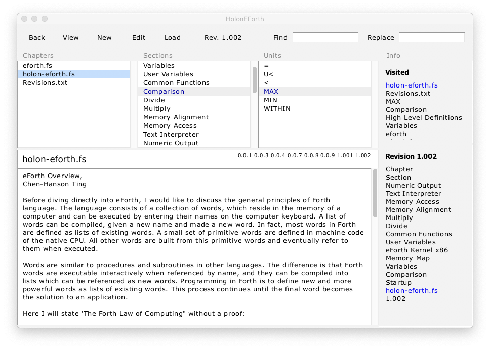
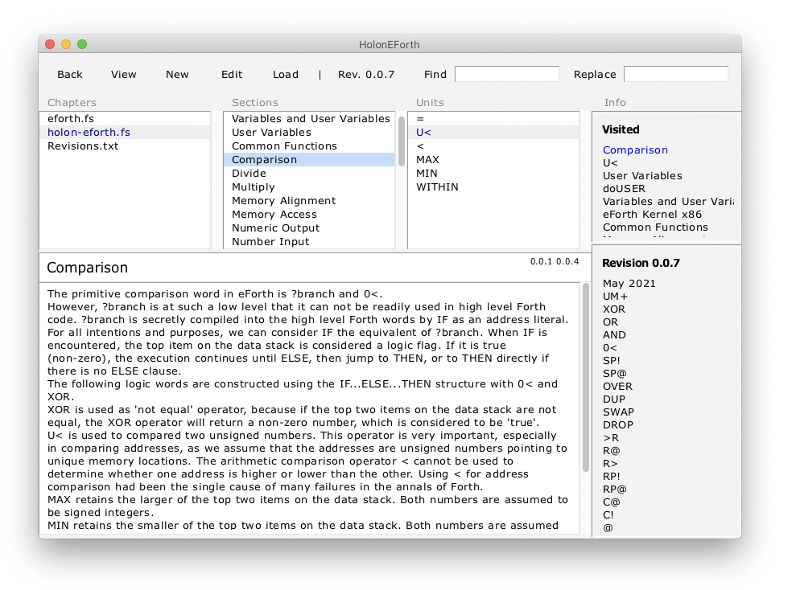
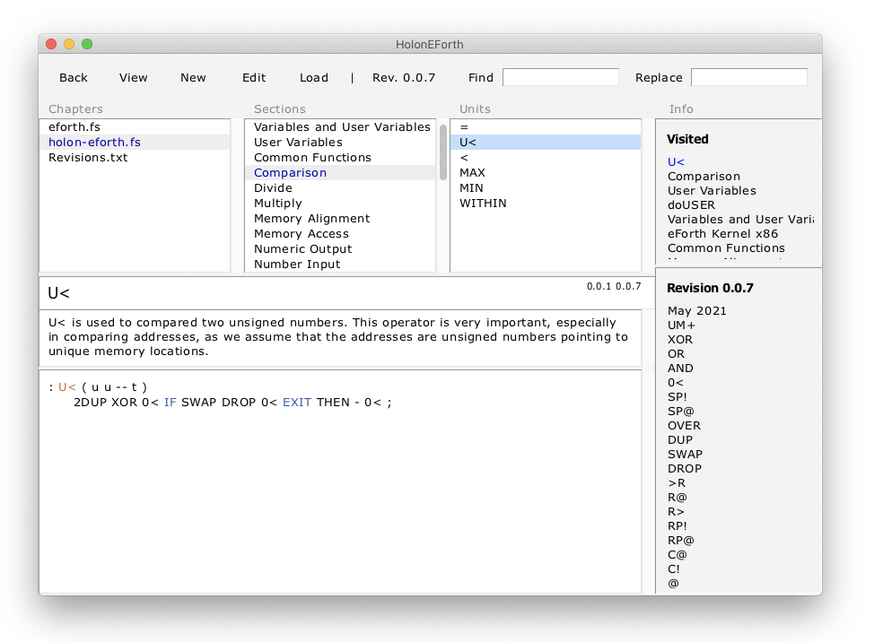
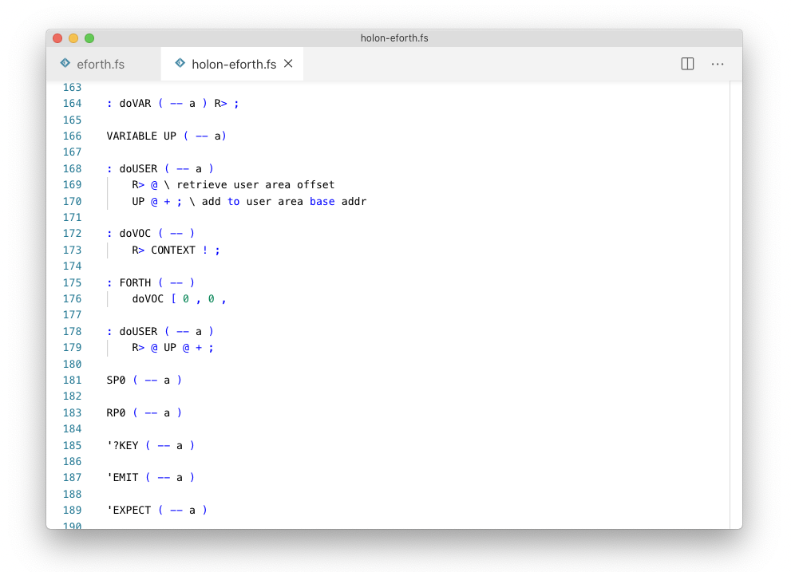

## HolonCode Projekt


## Textfile eforth.fs
- List of source code definitions and comments
- Comment lines create structure




---
## Browser HolonEforth

#### Content Management System

#### Book with Chapters, Sections and Pages
- Chapters create files with the code of the contained units 
- Each chapter and section offers a page for project documentation 
- Unit pages are divided into separate panes for code and comments 
- The title pane usually contains the name of the definition 
- The title name is as a target for hypertext links 
- Database is Tcl Metakit.  Views statt Tabellen 


## Chapter eforth.fs
- Chapter, Sections and Units have a page each
- No chapter text in eforth.fs




## Chapter HolonEForth.fs
- Page contains first part of OverviewEforth.pdf
- Sections extracted from document, as in eforth.fs
- Units of section Variables and User Variables



## Section 

- Section page is extract of eForth Overview 
- Units of section



## Unit 

- Units pages with source code definition and a separate space for comments
- The source code is written to the chapter file at the start of a session and on changes




## File HolonEForth.fs
- Chapterfile of HolonEForth
- Pipe to the interpreter/compiler
- Instantly updated with changes in the browser




## Features of HolonCode

see [HolonS](https://holonforth.com/holons.html)

---

## Run HolonEForth

#### Windows

```
tclsh .\src\holoncode.tcl HolonEForth.hdb
````

#### macOS and Linux

````
#!/bin/bash
cd `dirname $0` 
tclsh ./src/holoncode.tcl HolonEForth.hdb &
````

