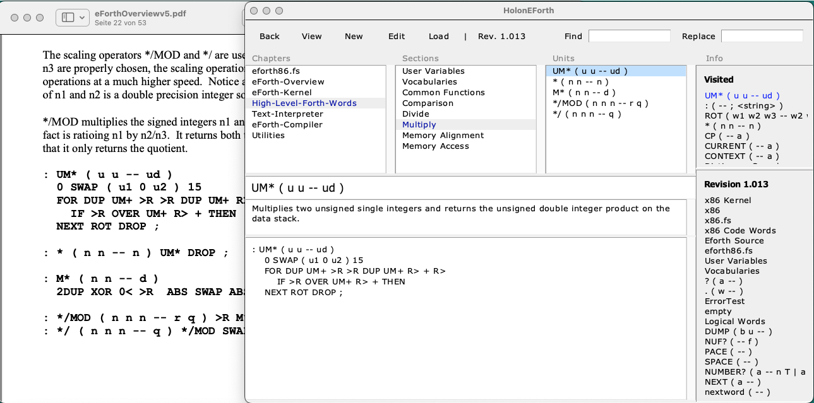

# HolonEForth

HolonEForth combines Chen-Hanson Ting's universal eforth.fs and eForthOverview.pdf.

It handles source code and documentation together in a CMS and presents it in a book view.

- Chapters create files if the name has a file extension.
- Chapters, sections and units have a page each. 
- Chapter and section pages collect project documentation.
- Unit pages contain source definition and separate comments.
	- Like a Forth system with One Word per Block.
- Automatic Hypertext links throughout the system.

## Run HolonEForth

HolonEForth works in Windows, macOS and Linux. Use the appropriate commandfile.

#### RunWindows.bat

#### RunMacOS.command

####  RunLinux.sh

--

#### tclsh

HolonEForth runs in Tcl/Tk. 

Download and install the free Tcl/Tk via https://docs.activestate.com/activetcl/8.6/

---

## Notes

HolonEForth is a [HolonCode](https://github.com/wejgaard/HolonCode) project. 

#### HolonEForth.hdb

The database of the HolonEForth CMS. 

#### Folder HolonEForth

Collects the chapter files generated in the project.

#### Folder holonxf

The Holoncode source files enhanced with stack notations. (This is a different story.)

---

## Using HolonEForth

#### Hyperlinks

In the texts and definitions unit names (Forth words) are hyperlinks.

Click to see the unit, control-click to see where the unit is used.

